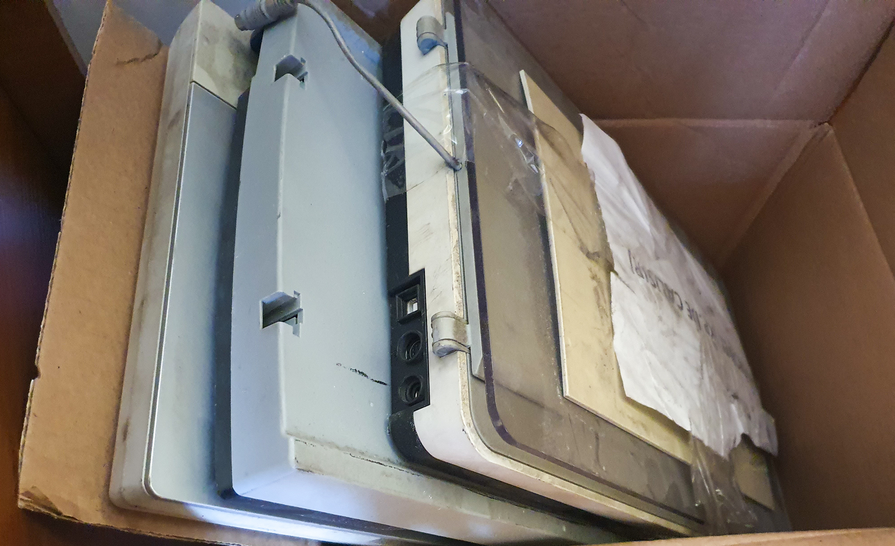
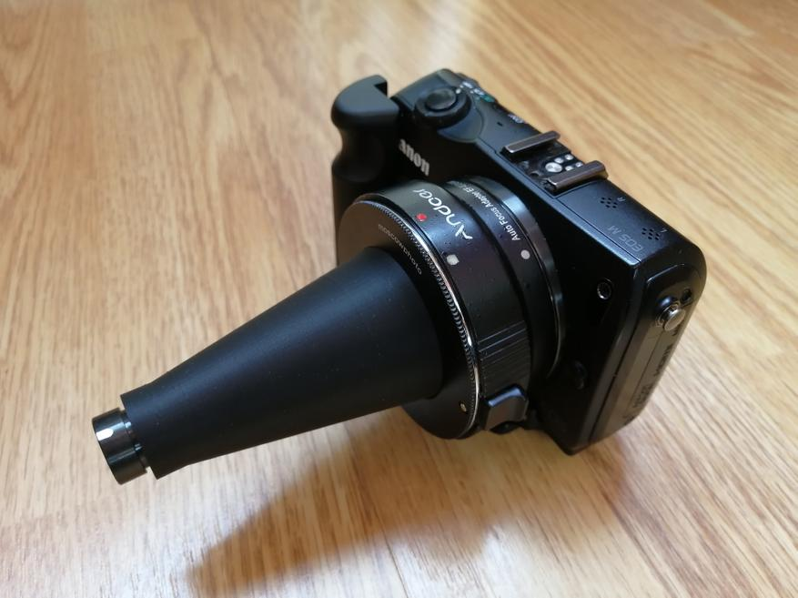
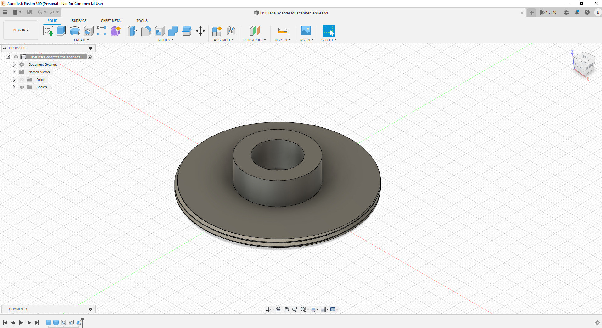

# Homemade Camera Lens Macro Nozzle (instructions, examples): an amazing macro world for everyone

### Do you want to try macro photography on an ordinary DSLR/mirrorless camera without spending money on an expensive macro lens? Do you think it's unrealistic? I'll prove below that it's real enough. With the help of an old scanner, and some wizardry, you can quickly turn any lens into a macro lens. Of course, not without drawbacks and not without flaws, but in any case, our hands are not for boredom and these self-made products bring a lot of positive emotions.

Just ahead of the comments, I say this idea is not mine. I recently came across a review on mysku.ru where the author, taking apart an old scanner, found the lens in it, and attach this lens to the lens was able to get good quality pictures with a very significant zoom. I lost a lot of sleep when I read that article. I came across another similar article on peekaboo. There was a slightly different approach to the construction of the lens itself, but the idea of using a lens from a scanner as a glass was the same.

I warn in advance about the large number of photos and traffic. Well, look at the photos when enlarged, it is more interesting. Take some time to read the article.

### And more to add. Because this product is made, so to speak, from moss and sticks, the quality of photos don't lengthen to professional macro lenses which cost over the moon. You can't get that for sure:

But nevertheless already with such equipment it is possible to achieve interesting results, and the process itself will take a lot of time.

In general, if I'm inspired by the idea, I will not calm down. CCD scanners are good for this project. That's what they have in their depths needed a lens.
### Along the way I asked around for scanners. One of my friends, who is an equipment repair guy, had a warehouse of old equipment. I went to him, rummaged around in the storeroom, and got three old scanners that had been scrapped:

The first and most important thing is done. I got the scanners. Now you need to take them apart. Here, in principle, there is no difficulty, even a crooked person can do it, because only one spare part is needed, and the rest can even be broken.

### And there are two options here. The first is to calculate the size of the lens and print a special adapter trunk on a 3D printer, which is then through an adapter M42 put on the camera. This is what it looks like:

So I chose the second way: we will make a ring adapter for the lens I already have. This way, we get a smaller focusing area, but we don't risk the camera's sensor.

### I use the Fujifilm X-T30. I have two lenses, a Fujinon 35mmF2 and a Fujinon 18-55. I decided to make an adapter for the 35mm lens first. It has a thread for ND filters, and that's where we will mount the attachment. In the Fusion360 we make a ring with an external thread and an internal tube to fit the lens: 

